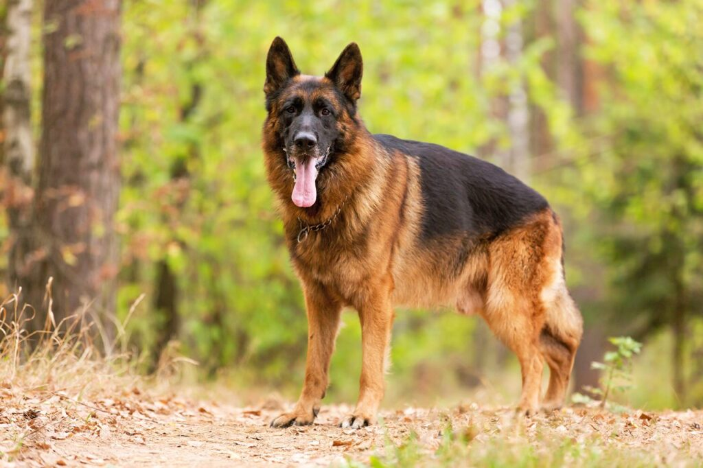
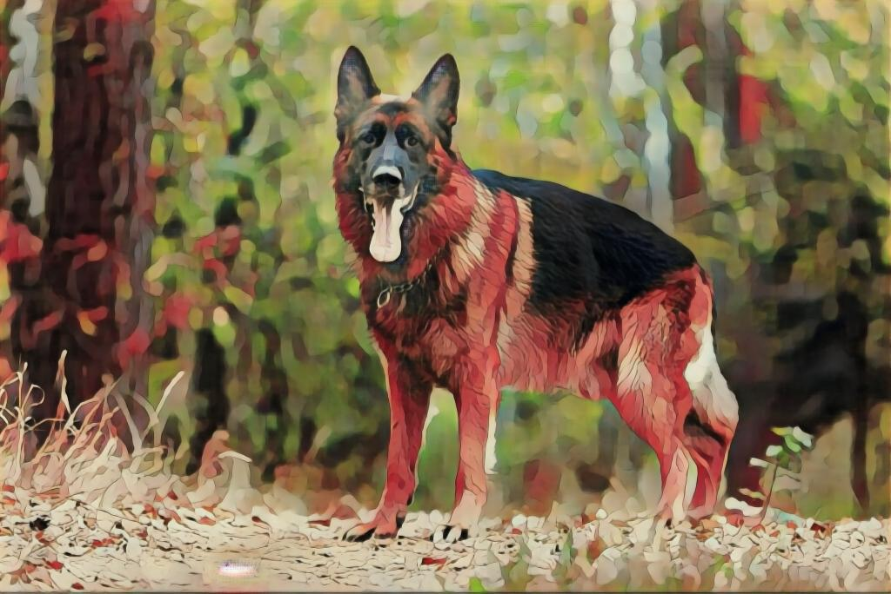
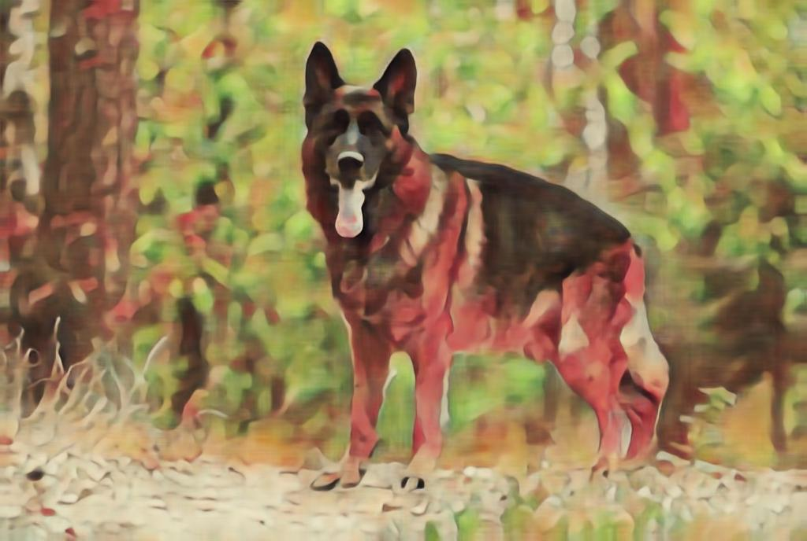
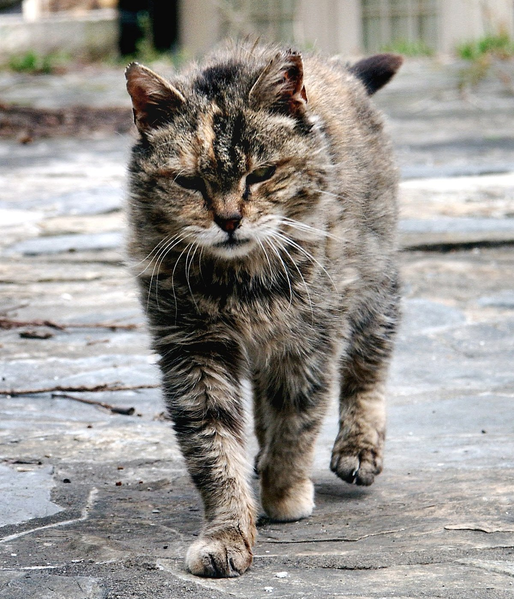
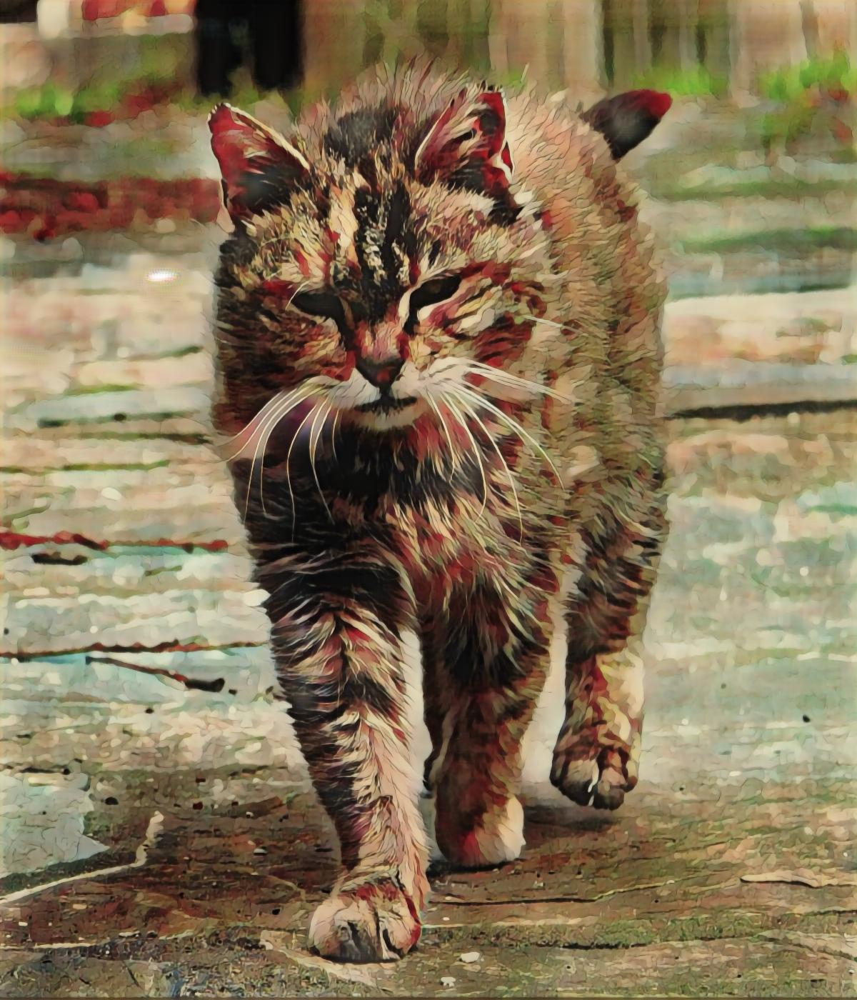
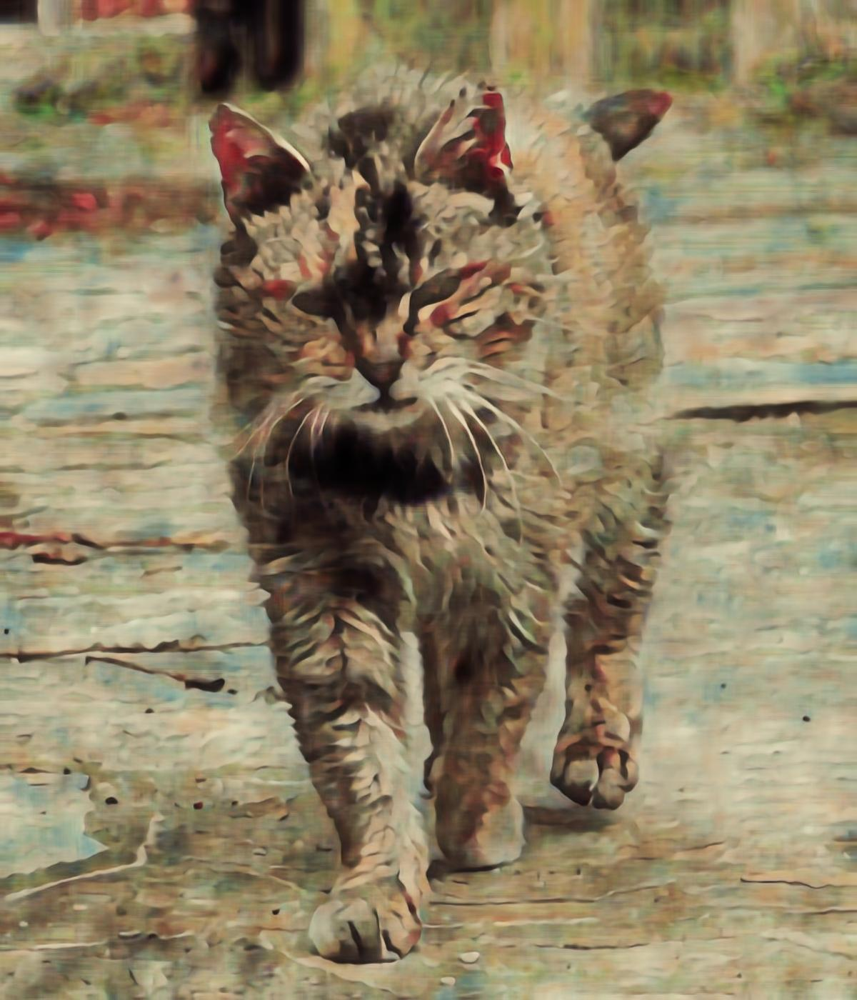
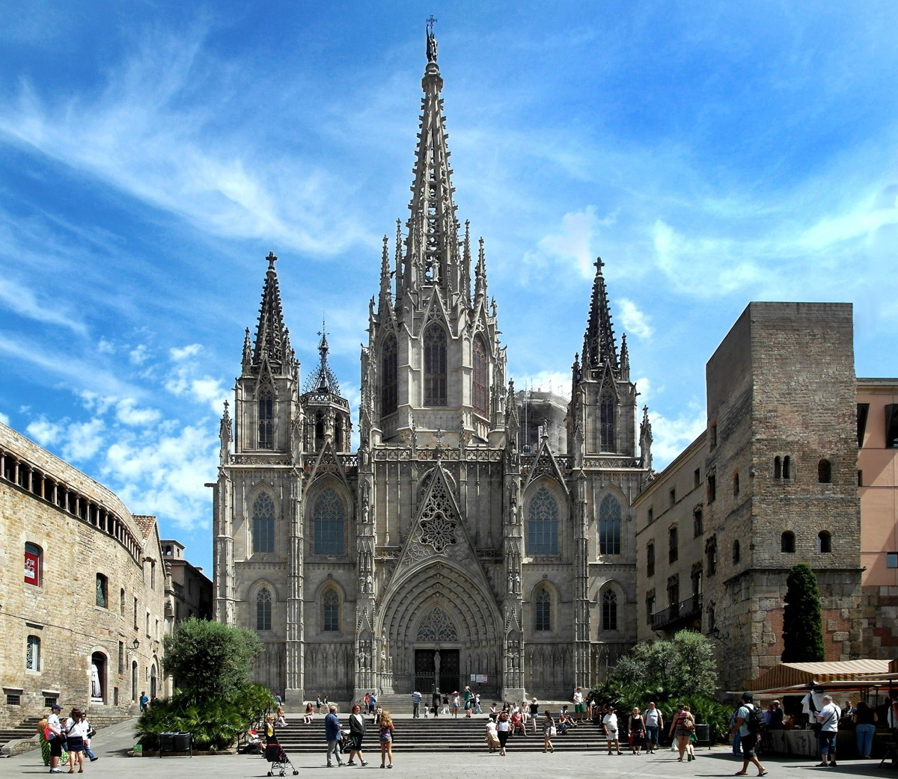
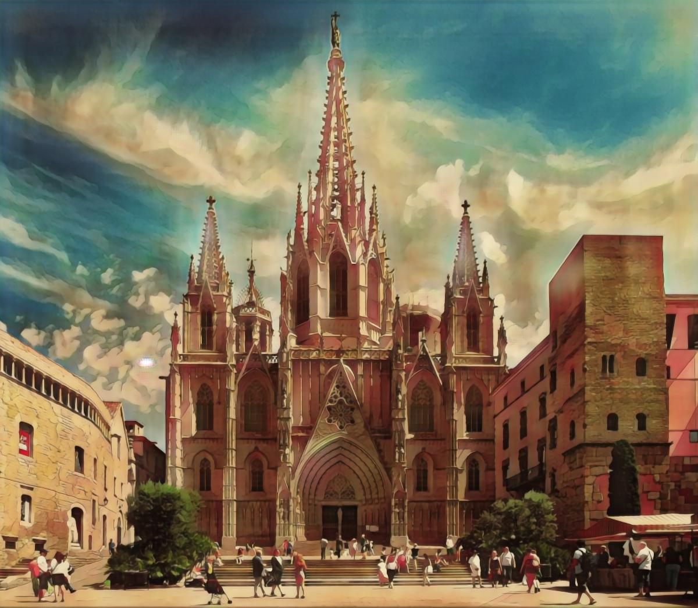
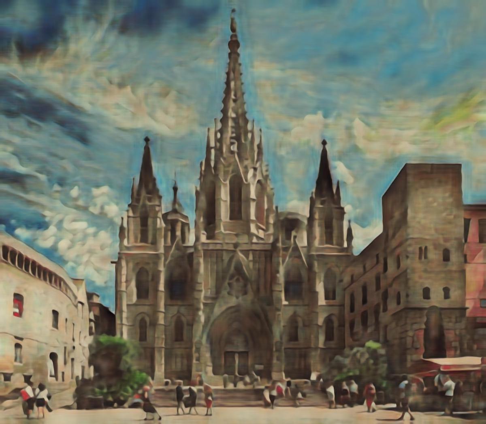

# CartoonizeNet

This repository contains neural networks trained to convert images into their comic versions. Two different approaches were implemented:

1. **GAN-based Conversion**: A generative adversarial network (GAN) is used initially, followed by fine-tuning through traditional supervised learning.
2. **AdaIN Style Transfer**: Another network is trained using AdaIN style transfer technique.

## Usage

To train and test the neural networks, follow these steps:

1. Ensure you have the necessary dependencies installed.
2. Run the Jupyter notebook files provided in the repository to train the networks.
3. After training, save the networks on your local machine.
4. Adjust the file paths in the testing scripts (test.py or console_test.py) according to your local setup.
5. Execute the testing script to convert your own images into comic versions.

## Example Results

| Original Image                 | GAN Conversion                 | AdaIN Style Transfer                        |
|--------------------------------|--------------------------------|---------------------------------------------|
|  |  |  |
|  |  |  |
|  |  |  |
